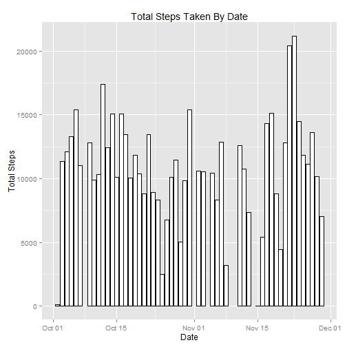
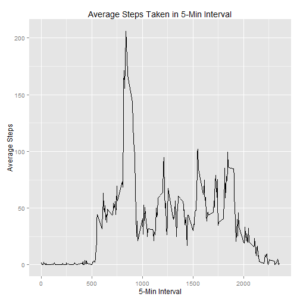
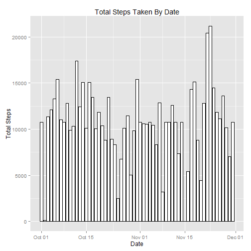
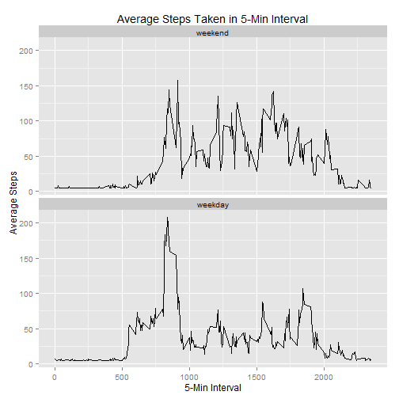

## Introduction

It is now possible to collect a large amount of data about personal movement using activity monitoring devices such as a Fitbit, Nike Fuelband, or Jawbone Up. These type of devices are part of the "quantified self" movement - a group of enthusiasts who take measurements about themselves regularly to improve their health, to find patterns in their behavior, or because they are tech geeks. But these data remain under-utilized both because the raw data are hard to obtain and there is a lack of statistical methods and software for processing and interpreting the data.

This analysis makes use of data from a personal activity monitoring device. The device collects data at 5 minute intervals through out the day. The data consists of two months of data from an anonymous individual collected during the months of October and November, 2012 and include the number of steps taken in 5 minute intervals each day.

## Data

The data for this assignment can be downloaded from the course web site:  
**.** Dataset: [Activity monitoring data](https://d396qusza40orc.cloudfront.net/repdata%2Fdata%2Factivity.zip) [52K]  
The variables included in this dataset are:  
**. steps**: Number of steps taking in a 5-minute interval (missing values are coded as NA)  
**. date**: The date on which the measurement was taken in YYYY-MM-DD format  
**. interval**: Identifier for the 5-minute interval in which measurement was taken  
The dataset is stored in a comma-separated-value (CSV) file and there are a total of 17,568 observations in this dataset.


## Loading and preprocessing the data

The data is loaded using read.csv():


```r
data <- data.table(read.csv("activity.csv", header = TRUE, sep = ",", quote = "\""))
head(data, n = 5)
```

```
##    steps       date interval
## 1:    NA 2012-10-01        0
## 2:    NA 2012-10-01        5
## 3:    NA 2012-10-01       10
## 4:    NA 2012-10-01       15
## 5:    NA 2012-10-01       20
```

First, let's ignore the missing values in the dataset, then calculate the total number of steps taken per day.  
The filter() function below serves two purposes:  
1. Remove all entries with steps = NA. So for the days that have all NAs, those days will not be used to calculate mean or median.  
2. Avoid warning msg during plotting: "Removed 8 rows containing missing values (position_stack)."

Creates a dataset of total number of steps taken each day:


```r
totalByDate <- data %>% group_by(date) %>% 
        filter(!is.na(steps)) %>% 
        summarize("totalSteps" = sum(steps))
totalByDate[["Date"]] <- as.POSIXct(strptime(totalByDate$date, "%Y-%m-%d"))
head(totalByDate, n = 5)
```

```
##         date totalSteps       Date
## 1 2012-10-02        126 2012-10-02
## 2 2012-10-03      11352 2012-10-03
## 3 2012-10-04      12116 2012-10-04
## 4 2012-10-05      13294 2012-10-05
## 5 2012-10-06      15420 2012-10-06
```

And the histogram shows the total number of steps taken each day:


```r
ggplot(totalByDate, aes(Date, totalSteps)) + 
        geom_histogram(stat = "identity", color = "black", fill = "white") +
        labs(title = "Total Steps Taken By Date") +
        labs(x = "Date", y = "Total Steps")
```

 


```r
vMean <- format(round(mean(totalByDate$totalSteps), 2), nsmall = 2)
vMedian <- format(round(median(totalByDate$totalSteps), 2), nsmall = 2)
```

The mean and median of the total number of steps taken per day are 10766.19 and 10765.00, respectively. There were 8 days that had no data at all, and these were not used to claculate mean or median.

## The average daily activity pattern

Calculates the average number of steps taken averaged across all days for each 5-minute interval:


```r
meanByInterval <- data %>% group_by(interval) %>% 
        summarize("meanSteps" = mean(steps, na.rm = TRUE))
head(meanByInterval, n = 5)
```

```
##   interval meanSteps
## 1        0 1.7169811
## 2        5 0.3396226
## 3       10 0.1320755
## 4       15 0.1509434
## 5       20 0.0754717
```

Below shows a time series plot (i.e. type = "l") of the 5-minute interval (x-axis) and the average number of steps taken, averaged across all days (y-axis):


```r
ggplot(meanByInterval, aes(interval, meanSteps)) + geom_line() +
        labs(title = "Average Steps Taken in 5-Min Interval") +
        labs(x = "5-Min Interval", y = "Average Steps")
```

 


```r
maxInterval <- meanByInterval[which.max(meanByInterval$meanSteps)]$interval
maxIntervalFormat <- format(strptime(sprintf("%04d", maxInterval), "%H%M"), "%r")
avgSteps <- format(round(max(meanByInterval$meanSteps), 2), nsmall = 2)
```

The 5-minute interval on average across all the days in the dataset contains the maximum number of steps is: 835, or 08:35:00 AM. The respective average steps is: 206.17.

## Imputing missing values

Note that in the original data set, there are a number of days/intervals where there are missing values (coded as NA). Let's analyze if the presence of missing days introduces bias into some calculations or summaries of the data.


```r
totNaRows <- nrow(filter(data, is.na(steps)))
```
The total number of missing values in the dataset (i.e. the total number of rows with NAs) is: 2304.

To fill in all of the missing values in the dataset, let's use the mean for the 5-minute interval:


```r
filledSteps <- mean(filter(data, !is.na(steps))$steps)
data$steps[which(is.na(data$steps))] <- filledSteps
```

Creates a new dataset that is equal to the original dataset but with the missing data filled in:


```r
totalByDateFilled <- data %>% group_by(date) %>% 
        summarize("totalSteps" = sum(steps))
totalByDateFilled[["Date"]] <- as.POSIXct(strptime(totalByDateFilled$date, "%Y-%m-%d"))
```

And the histogram shows the total number of steps taken each day with the missing data filled in:


```r
ggplot(totalByDateFilled, aes(Date, totalSteps)) + 
        geom_histogram(stat = "identity", color = "black", fill = "white") +
        labs(title = "Total Steps Taken By Date") +
        labs(x = "Date", y = "Total Steps")
```

 


```r
vMeanFilled <- format(round(mean(totalByDateFilled$totalSteps), 2), nsmall = 2)
vMedianFilled <- format(round(median(totalByDateFilled$totalSteps), 2), nsmall = 2)
```
The mean and median of the total number of steps taken per day are: 10766.19 and 10766.19, respectively.

The mean is the same as that from previous section where NAs rows were just ignored, while the median is slightly different.  Since the mean for the 5-minute interval is used to fill in the missing number of steps, and during calucalation of this mean all NAs must be excluded, the total daily number of steps with filled in data is actually the mean of that without filled in data.

## Analyze differences in activity patterns between weekdays and weekends

For this part of analysis, the weekdays() function is used to create a new factor variable in the dataset with two levels - "weekday" and "weekend" indicating whether a given date is a weekday or weekend day. The dataset with the filled-in missing values is used for this part.  


```r
weekdaysGrp <- c("Monday", "Tuesday", "Wednesday", "Thursday", "Friday")
data[["wDay"]] <- factor((weekdays(as.POSIXct(strptime(data$date, "%Y-%m-%d"))) %in% weekdaysGrp), 
                         levels=c(FALSE, TRUE), labels=c("weekend", "weekday")) 
head(data, n = 5)
```

```
##      steps       date interval    wDay
## 1: 37.3826 2012-10-01        0 weekday
## 2: 37.3826 2012-10-01        5 weekday
## 3: 37.3826 2012-10-01       10 weekday
## 4: 37.3826 2012-10-01       15 weekday
## 5: 37.3826 2012-10-01       20 weekday
```

Calculates the average number of steps taken averaged across all days for each 5-minute interval, separated the calculation by weekdays and weekends.


```r
meanByIntervalWDay <- data %>% group_by(wDay, interval) %>% 
        summarize("meanSteps" = mean(steps, na.rm = TRUE))
head(meanByIntervalWDay, n = 5)
```

```
##      wDay interval meanSteps
## 1 weekday        0  7.006569
## 2 weekday        5  5.384347
## 3 weekday       10  5.139902
## 4 weekday       15  5.162124
## 5 weekday       20  5.073235
```

Below shows a time series plot (i.e. type = "l") of the 5-minute interval (x-axis) and the average number of steps taken, averaged across all weekday days or weekend days (y-axis):


```r
ggplot(meanByIntervalWDay, aes(interval, meanSteps)) + 
        facet_wrap(~ wDay, nrow = 2, ncol = 1) + geom_line() +
        labs(title = "Average Steps Taken in 5-Min Interval") +
        labs(x = "5-Min Interval", y = "Average Steps")
```

 

As the plot shows, the average steps taken during weekend is about 80 between 8:00 AM and 8:00 PM, and the highest average steps taken during weekday is about 170 between 8:00 AM and 9:00 AM.
